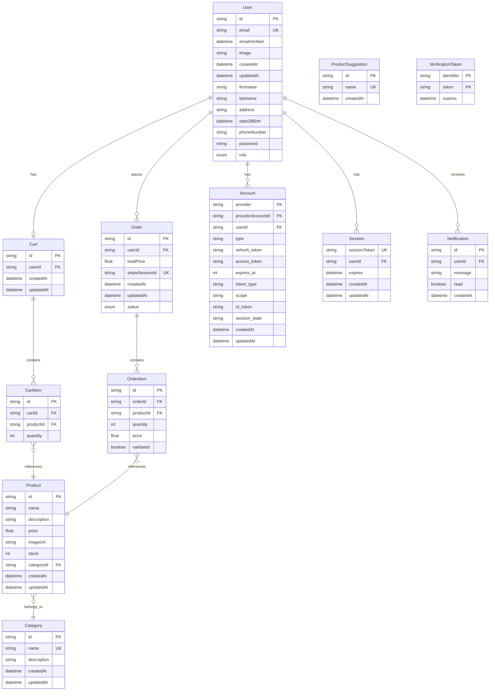

# Database Schema UML

```mermaid
erDiagram
    User ||--o| Cart : has
    User ||--o{ Order : places
    User ||--o{ Account : has
    User ||--o{ Session : has
    User ||--o{ Notification : receives

    Cart ||--o{ CartItem : contains
    CartItem }o--|| Product : references

    Order ||--o{ OrderItem : contains
    OrderItem }o--|| Product : references

    Product }o--|| Category : belongs_to
    
    User {
        string id PK
        string email UK
        datetime emailVerified
        string image
        datetime createdAt
        datetime updatedAt
        string firstname
        string lastname
        string address
        datetime dateOfBirth
        string phoneNumber
        string password
        enum role
    }

    Category {
        string id PK
        string name UK
        string description
        datetime createdAt
        datetime updatedAt
    }

    Product {
        string id PK
        string name
        string description
        float price
        string imageUrl
        int stock
        string categoryId FK
        datetime createdAt
        datetime updatedAt
    }

    ProductSuggestion {
        string id PK
        string name UK
        datetime createdAt
    }

    Cart {
        string id PK
        string userId FK
        datetime createdAt
        datetime updatedAt
    }

    CartItem {
        string id PK
        string cartId FK
        string productId FK
        int quantity
    }

    Order {
        string id PK
        string userId FK
        float totalPrice
        string stripeSessionId UK
        datetime createdAt
        datetime updatedAt
        enum status
    }

    OrderItem {
        string id PK
        string orderId FK
        string productId FK
        int quantity
        float price
        boolean validated
    }

    Notification {
        string id PK
        string userId FK
        string message
        boolean read
        datetime createdAt
    }

    Account {
        string provider PK
        string providerAccountId PK
        string userId FK
        string type
        string refresh_token
        string access_token
        int expires_at
        string token_type
        string scope
        string id_token
        string session_state
        datetime createdAt
        datetime updatedAt
    }

    Session {
        string sessionToken UK
        string userId FK
        datetime expires
        datetime createdAt
        datetime updatedAt
    }

    VerificationToken {
        string identifier PK
        string token PK
        datetime expires
    }
```
